# CRM — Module overview for testing

**Purpose:** give the client the key flow of the CRM module and enough detail on each screen, status and rule to start using it and write test cases. Not a click-by-click guide — the obvious controls are left to the screen itself.

**Pages covered:**

| Page | URL | What it does |
|---|---|---|
| Customers | `/crm/companies` | The company book — one table, three tabs: **Assigned** · **Free data** · **Archived** |
| Company record | `/crm/companies/:id` | Everything about one company: account, contacts, users, quota, claim requests, owner history, Verify |
| New company | `/crm/companies/new` | The admin's create form (the same form the Sign-ups **Create company & activate** action opens) |
| Sign-ups | `/crm/sign-ups` | Employers who self-registered on the Company site, waiting to be placed |
| Claim requests | `/crm/company-claims` | A rep's own log of Free-data requests and their outcome |
| Company documents | `/crm/company-documents` | Accounting's queue: ERC files employers submitted, and legal-record change requests |
| Pipeline | `/crm/pipeline` | The deal board — six columns |
| Quotations | `/crm/quotations` · `/new` · `/:id` | The offer: 1–3 priced options |
| Purchase orders | `/crm/purchase-orders/:id` | The committed order, raised from the accepted option |
| Invoices | `/crm/invoices/:id` | The VAT e-invoice — issuing it is what grants the products |
| Employer sign-up | Company site `/auth/sign-up` | Where door C starts (see §1.1) |

Written against the requirement on the spec site (`/m/crm`) and the admin console `dev` branch as of 24/09/2026. Where the build and the requirement differ, the build is described and the difference is flagged **⚠ Build vs requirement**.

---

## 0 · How the pieces fit together

Read this once — every screen below is one step in this chain.

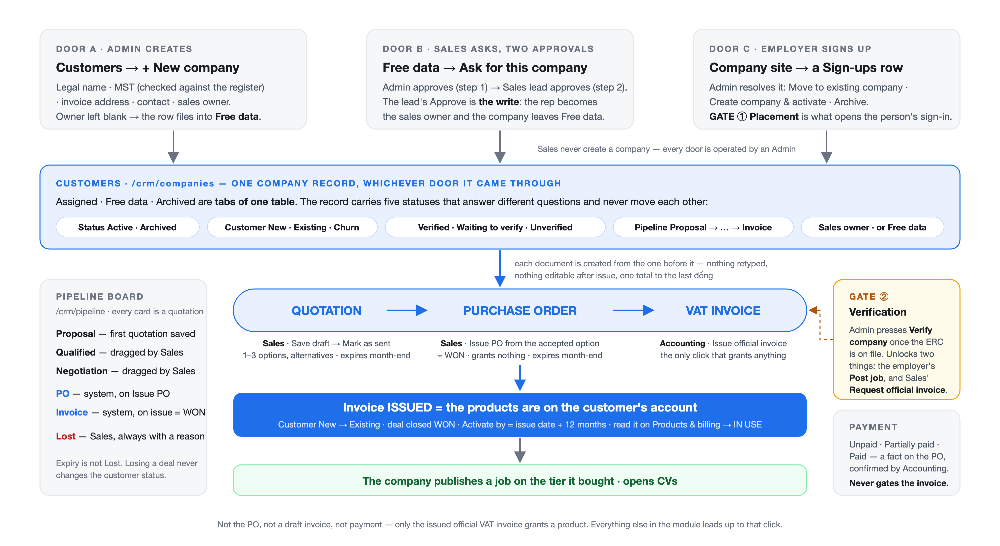
*DIAGRAM 1 — CRM: from a company to a granted product*

Five things to hold onto:

1. **One company table, three doors, all operated by an Admin.** A company reaches Customers by being created on the form, by being claimed out of Free data, or by being created while resolving a sign-up. **Sales never create a company** — the only ways to own one are the claim (two approvals) or a direct assignment by an Admin.
2. **A self-registered employer passes two gates, in order.** Gate ① **Placement** — an admin resolving the Sign-ups row is what opens sign-in. Gate ② **Verification** — an admin pressing **Verify company** against the ERC is what opens posting a job and requesting the official invoice. Nothing else is locked behind either gate.
3. **Three documents, one number.** Quotation → Purchase order → VAT invoice. Each is created from the one before it, nothing is retyped, and none can be edited after issue. The invoice total must equal the PO, which must equal the accepted option — to the last đồng.
4. **Issuing the official VAT invoice is the only event that grants anything.** Not the PO (that is the "won" moment, and it provisions nothing), not a draft invoice, not payment. The moment accounting issues it, the products are on the company's account and the activation clock starts.
5. **Statuses sit on separate axes and must never be wired together.** Company status (Active/Archived), customer status (New/Existing/Churn), verification (three labels), pipeline stage, the three document statuses and payment state each answer a different question. Losing a deal does not change customer status; an unpaid invoice is still an issued invoice.

---

## 1 · Customers — `/crm/companies`

### What it is

The **customer book**: every company the platform knows, as one table. Three tabs partition it — every company is in exactly one:

| Tab | Rows | Meaning |
|---|---|---|
| **Assigned** (default) | Active companies **with a sales owner** | The customers reps actually work. Also called *Owned* in earlier builds |
| **Free data** | Active companies **with no sales owner** | The pool — same table, read-only for reps until claimed (§2) |
| **Archived** | Status = Archived | The register of companies taken out of service, with the reason |

Above the table: scope **Mine / My team's / All**, search by name, short name or tax code, **Filter** (industry, region, customer status, pipeline stage, verification, owner) and a sort. **Claim requests** and **Sign-ups** are *not* tabs here — they are different tables with their own pages.

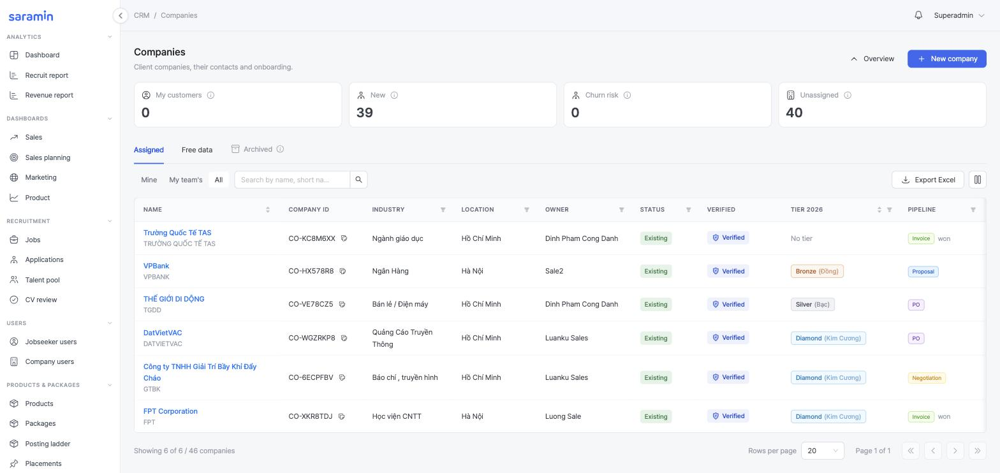
*Customers — the Assigned tab*

### 1.1 · How a company is created — three doors

| Door | Who operates it | What is required | Where it lands |
|---|---|---|---|
| **A · Customers → + New company** | Admin | Legal name · **MST** (the **Check** button looks it up in the national business register and fills the registered address) · invoice address / buyer classification · primary contact · **sales owner** · optional verification document. Leaving the owner blank files the company into **Free data** | Assigned (or Free data when unowned) |
| **B · Free data → Ask for this company** | Sales rep asks; **Admin** then **Sales lead** approve | A reason, the customer type, evidence (link or file). The record must carry an MST before the lead can approve | Assigned — the rep becomes the sales owner (§2) |
| **C · Company site → Sign up** | Employer registers; **Admin** resolves the row | Employer: MST · company name · ERC (optional) · full name · email · phone · password. Admin: **Create company & activate** (opens door A's form prefilled) or **Move to existing company** | Assigned/Free data as the form decides; the company is **Unverified** and the person is its first admin (§3) |

Rules that apply to every door:

- **MST is write-once, globally unique, 10 digits or 10 + `-001` for a branch.** A duplicate is refused and names the company that holds it. A company with no MST can never publish a posting or be invoiced.
- **A foreign company has no Vietnamese MST** — the form asks for none; the invoice still needs the legal name and address.
- **Short name** is suggested from the legal name (legal form stripped, upper-cased) and printed on lists; the **legal name** is what every document prints.
- **Parent / subsidiary** is a link between two full records. Nothing is shared or inherited down the tree — each company keeps its own MST, quota, invoices and sales owner.

### 1.2 · The company record — what to read

The stat row is the account summary: **Tier** (cumulative revenue in the programme year), **Customer since**, **Open jobs**, **Job quota** (slots left, all tiers), **CV unlocks**, **Sales owner**.

Header actions: **Call** · **Archive** · **Verify company** (only while not Verified) · **View on jobseeker** · **+ Create quotation** — the only create action on a company, because a quotation is valid for every company in every status. There is no Create-PO and no Convert button: the PO comes from the quotation, and "becoming a customer" is driven by the invoice.

Tabs: **Overview** (profile, billing data, affiliated companies, activity) · **Contacts** · **Users** (the customer's own logins — invited by email, never handed a password) · **Products & billing** · **Company page** · **Jobs** · **Claim requests** · **Owner history** · **Applications** · **Resumes**.

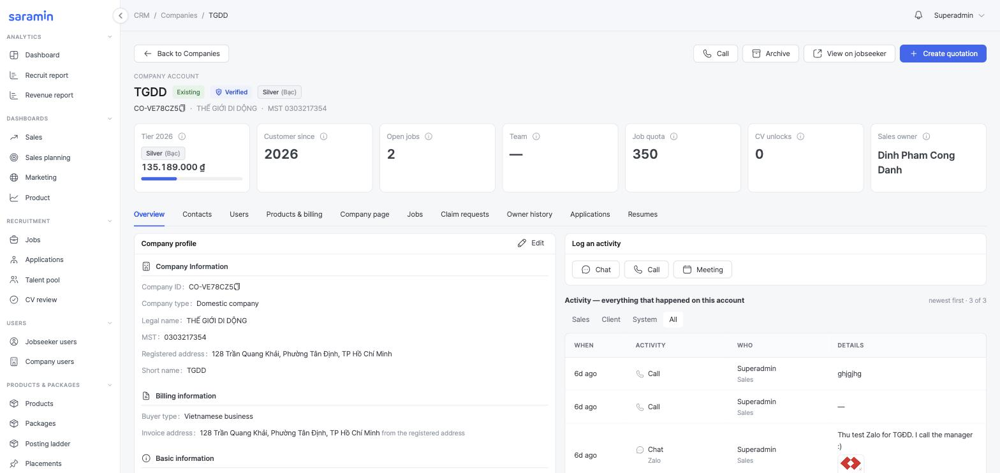
*Company record — header with the verification tag, stat row and tabs*

### 1.3 · Statuses on a company — five independent axes

This is the table to test against. Each axis is set by a different actor and none of them moves another.

| Axis | Values | Set by | Note |
|---|---|---|---|
| **Company status** | **Active** · **Archived** | Admin / sales lead (Archive, with a reason) | Active is the default *including for a churned customer*. Archived = stops generating work; requires a reason from a fixed list (Bankrupt/dissolved · Merged · Duplicate · Violation · Other); reversible with **Restore**. There is no "Inactive" |
| **Customer status** | **New** · **Existing** · **Churn** | System only | New from creation. → Existing on the **first issued VAT invoice**. → Churn 12 months after the last invoice with no new order. A won win-back returns to Existing, never New |
| **Verification** | **Unverified** · **Waiting to verify** · **Verified** | Admin (**Verify company**) | Derived on every read: Verified = an admin pressed Verify · Waiting = not verified **and** at least one ERC on file · Unverified = no paperwork yet. §3.3 |
| **Pipeline** | Not in pipeline · Proposal · Qualified · Negotiation · PO · Invoice | Sales (first three) · System (PO, Invoice) | Read from the company's one open deal. "Lost" is not a stage — a lost deal keeps the stage it died in. §7 |
| **Sales owner** | a rep · unassigned | Admin (assign / claim approval / handover) | Unassigned **is** Free data. Every change is written to **Owner history** |

And one that is pure arithmetic — **Membership tier**, from the value of paid orders in the current programme year:

| Tier | From | To below |
|---|---|---|
| — (no tier) | 0 ₫ | 30,000,000 ₫ |
| Member | 30,000,000 ₫ | 50,000,000 ₫ |
| Bronze | 50,000,000 ₫ | 100,000,000 ₫ |
| Silver | 100,000,000 ₫ | 200,000,000 ₫ |
| Gold | 200,000,000 ₫ | 300,000,000 ₫ |
| Diamond | 300,000,000 ₫ | — |

### 1.4 · Products & billing — where a granted product is confirmed

After accounting issues an invoice, this tab is where the result is read: **Purchases, by invoice** lists each issued invoice (legal number · our INV- reference · issue date) with its product lines — **job slots**, the date they run **until**, and **N/M used**. The **Job quota** card at the top is the roll-up across all tiers; this tab is per invoice and per product. Orders raised but not yet invoiced are counted in a line of their own — *nothing from them is granted*.

Quota moves for exactly three reasons: an issued invoice grants it, publishing or upgrading a job spends it, unlocking a CV deducts credit. **There is no manual grant** — a quota number that changed for any other reason is a bug.

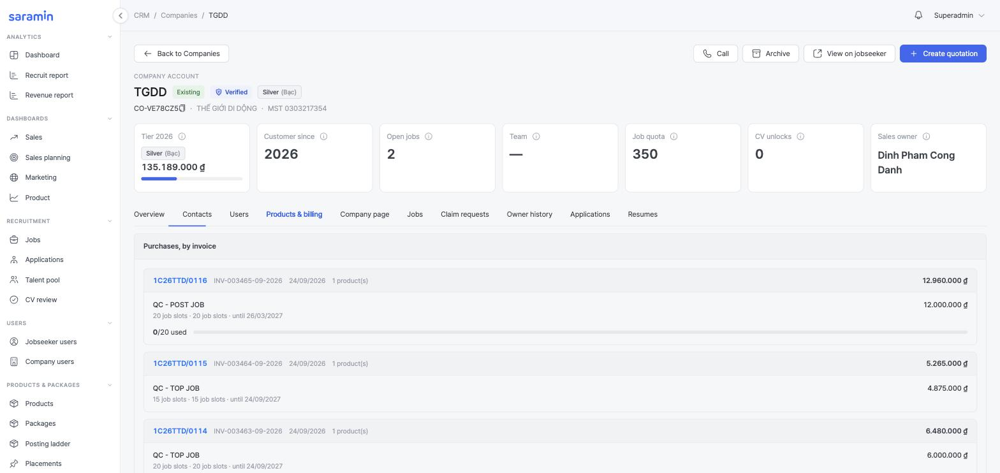
*Company record — Products & billing: purchases by invoice, slots and expiry per product*

### Test it by

1. Create a company with the owner blank → it appears under **Free data**, not Assigned.
2. Create a second company with the same MST → refused, the message names the first company.
3. Archive a company → it leaves Assigned and every filter, appears under Archived with its reason; **Restore** brings it back unchanged.
4. Issue an invoice to a **New** company → customer status reads **Existing** on the row and the record; close a deal as lost on another **New** company → it stays **New**.

---

## 2 · Free data & claim requests

### What it is

**Free data and Customers are one table at two levels of completeness.** A Free-data row needs only a company name; its tax code is unverified; it has no sales owner, no last-contact clock, and it is counted in no CRM figure — it cannot carry a quotation, PO or invoice. "Promoting" a row is not a copy: it is **completing the record and giving it an owner**.

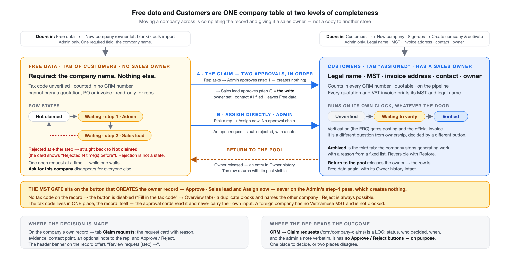
*DIAGRAM 2 — Free data ↔ Customers: one table, two states, and how a company crosses over*

Requirement source (spec site): [One company table, two states — and two admin-only create doors](https://saramin-eta.vercel.app/m/crm/danh-ba-doanh-nghiep-free-company-data#one-company-table-two-states-and-two-admin-only-create-doors)

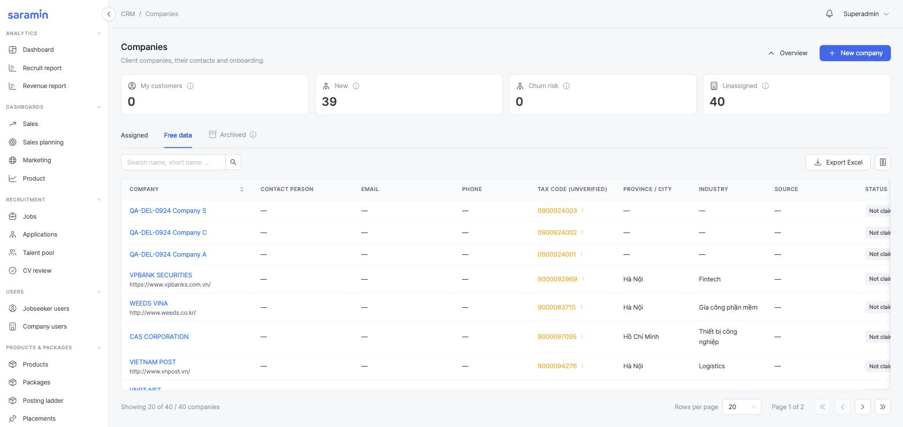
*Customers — the Free data tab*

### 2.1 · Pool states — two, and rejection is not one of them

| Row reads | Means | Claimable? |
|---|---|---|
| **Not claimed** | Free — nobody has asked | Yes — **Ask for this company** on the record |
| **Waiting · step 1 · Admin** | A rep asked; the Admin has not decided | No — one open request at a time. The button disappears for everyone else |
| **Waiting · step 2 · Sales lead** | The Admin passed it; the Sales lead decides | No |
| *(rejected)* | **Not a state.** The *request* is Rejected; the company returns to **Not claimed** and shows *Rejected N time(s) before* | Yes — anyone may ask again, including the same rep |

Approval is the only thing that removes a row from Free data: the company is a customer now.

### 2.2 · The claim — two approvals, one open request, one bypass

| Step | Who | Where | What happens |
|---|---|---|---|
| 1 · Ask | Sales rep | Free data → the company record → **Ask for this company** | Form: **Request details** (reason + contact point), **Customer type in Free data**, evidence **Link** or **Attachment** (optional). Two customer types describe a company that already has a Saramin package — those block submit: that is a customer, ask for a transfer instead |
| 2 · Lock | System | The row | Status → **Waiting · step 1 · Admin**. Nobody else can ask until it is settled |
| 3 · Step 1 | **Admin** | Company record → tab **Claim requests** (the header banner offers *Review request →*) | Reads reason, evidence, contact → optional note to the rep → **Approve · Admin** (passes it to the lead; *nothing is created yet*) or **Reject** (final; company back to Not claimed) |
| 4 · Step 2 | **Sales lead** | Same card, now stamped *Admin approved {when} · {who}* | **Approve · Sales lead** = **the one write**: the rep becomes sales owner, the contact point becomes contact #1, the company leaves Free data, every other open request is rejected. **Reject** is final and does not bounce back to the Admin |
| 5 · Follow | Sales rep | **CRM → Claim requests** (`/crm/company-claims`) | The log: status, who decided, when, and the admin's note verbatim. **No buttons here, on purpose** — decisions live on the company record |
| Bypass | **Admin** | Company record → Claim requests tab → **Assign directly · Admin** | Pick a rep → **Assign now**. No approval chain. An open request is rejected automatically with a note naming the assignee. On an owned company the same card reads **Change sales owner** / **Reassign** |

**The MST gate sits on the button that creates the owner record** — the lead's Approve and the Admin's Assign — never on the Admin's step-1 pass, which creates nothing. Without a tax code the button is disabled (*Fill in the tax code* → Overview); a duplicate blocks and names the other company. Reject is always possible.

**Return to the pool** on an owned company releases it back to Free data. The release is an entry in Owner history (the chain shows *closed — nobody is responsible right now*), and the row arrives in the pool with its past visible to the next approver.

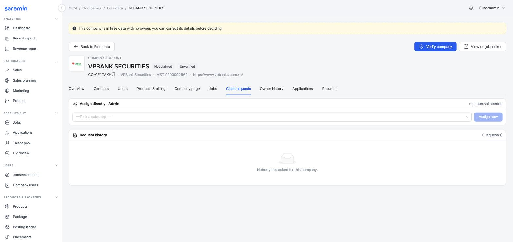
*Free-data company record — Claim requests tab: the Assign directly · Admin card and the request history (no request open on this environment; a pending request renders as a card here with Approve / Reject)*

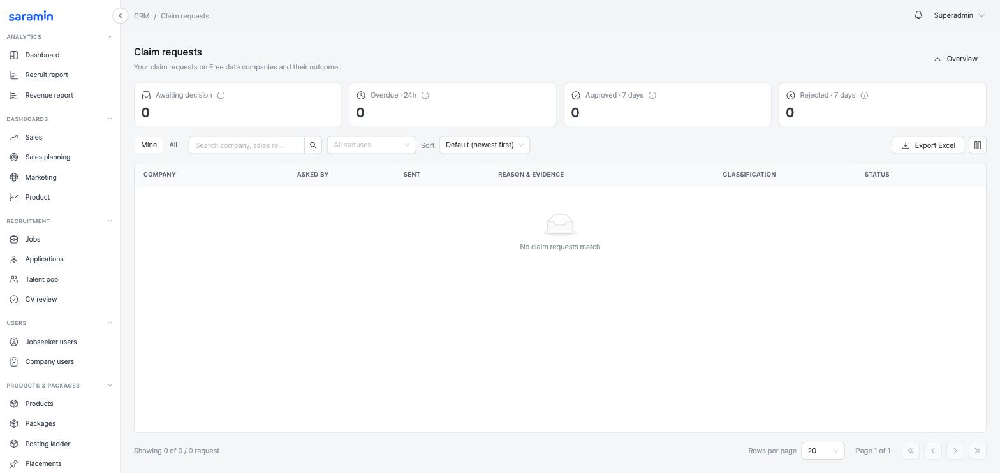
*CRM → Claim requests — the rep's log*

> **⚠ Build vs requirement.** The requirement text collects no reason on rejection ("tạm thời từ chối không cần lý do"); the build has an optional **note to the rep** on every decision, which the rep reads on their log. The requirement's "đã từ chối N lần" marker is built as *Rejected N time(s) before* on the card.

### Test it by

1. Rep A asks for a company → the row reads **Waiting · step 1 · Admin**; rep B opens the same record → no Ask button.
2. Admin approves → **Waiting · step 2 · Sales lead**; the company is still in Free data with no owner.
3. Lead approves → the company is on **Assigned** with rep A as owner; the row is gone from Free data; contact #1 is the contact point from the form.
4. Lead rejects instead → the company reads **Not claimed · Rejected 1 time before**; rep A's log shows the note; rep A can ask again.
5. Remove the MST from a pool record (or pick a foreign company) → Approve · Sales lead is disabled with *Fill in the tax code*; Reject still works.
6. Admin uses **Assign directly** while a request is open → the company is owned; the request reads Rejected with an automatic note.

---

## 3 · Sign-ups & company verification

### 3.1 · The flow — employer on the Company site, admin in the console, two gates between them

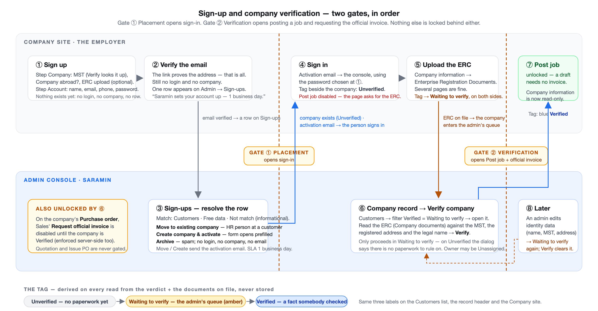
*DIAGRAM 3 — Sign-up and verification: two gates, in order*

Requirement source (spec site): [The flow — employer on the Company site, admin in the console](https://saramin-eta.vercel.app/m/crm/sign-ups#the-flow-employer-on-the-company-site-admin-in-the-console-one-flag-between-them)

| # | Where | Who | What happens | State after |
|---|---|---|---|---|
| ① | Company site · **Sign up** | Employer | Step *Company*: **MST** (Verify looks it up), *Company abroad* switch, **ERC upload** (or *I'll verify next time*). Step *Account*: full name, email, phone, password, consents → Create account | Nothing exists yet — no login, no company, no row |
| ② | Email | Employer | Clicks the verification link. **This proves the address; it does not open the console** | Email verified · **one row on Sign-ups** · still no login |
| ③ | Admin · **Sign-ups** | Admin | Resolves the row with one of three actions (§3.2). **Move** and **Create** send the activation email | Company exists (**Unverified**) · login opens when the person clicks the link |
| ④ | Company site | Employer | Signs in with the password from ①. Tag beside the company name: **Unverified / No paperwork**; **Post job is disabled** and asks for the ERC | Unverified |
| ⑤ | Company site · **Company information** | Employer | Uploads the **ERC** (Giấy chứng nhận đăng ký doanh nghiệp; several pages fine) | **Waiting to verify** — on both sides, without anyone setting it |
| ⑥ | Admin · **Customers** → company record | Admin | Filters **Verified = Waiting to verify**, opens the record, reads the ERC (**Company documents**) against the MST, registered address and legal name → **Verify company** | **Verified** |
| ⑦ | Both sites | System | Blue **Verified** tag. Employer: **Post job** unlocked (a draft needs no invoice). Sales: **Request official invoice** enabled on the PO | Verified |
| ⑧ | Admin · company record · edit | Admin | Saves a change to identity data (legal name, MST, registered address, buyer block) | Back to **Waiting to verify** · *re-check needed* → ⑥ again |

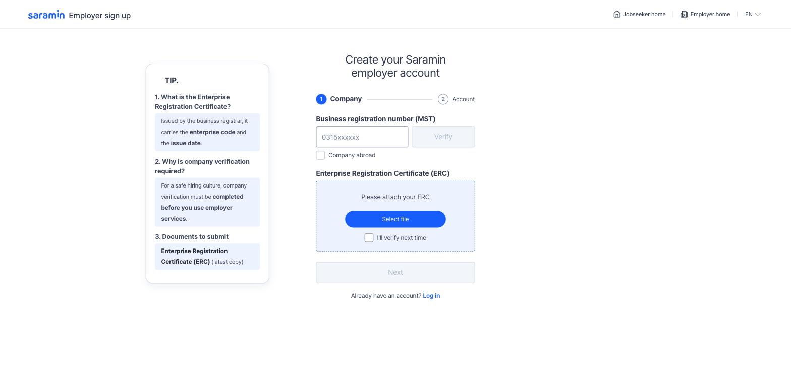
*Company site — Employer sign-up, step Company (MST + ERC)*

### 3.2 · The Sign-ups screen — three actions, every row resolved

Columns: Full name · Email · Phone · Tax number · Company type (Domestic / Abroad) · Company name · **ERC** (opens the file) · Hiring · **Email verified** · **Match** · Status · When. Stat tiles: Waiting · Overdue 24h · Arrived 7 days · Resolved 7 days.

| Action (⋯ menu) | When | What it does |
|---|---|---|
| **Move to existing company** | Match names a **Customers** company | Dialog: **Destination company** (pre-selected from the tax-code match, changeable) + **Role in that company** (blank = Company Admin) → **Place sign-up**. Creates the login inside that company, mails a sign-in notice. No new company |
| **Create company & activate** | Not match — a genuinely new company | Opens the **New company** form prefilled from the row; the notice on the form says it also activates the person as the company's first admin. Company lands Unverified |
| **Archive** | Spam, test, duplicate | Rejects the request with an optional reason (emailed to the person). No login, no company. Kept with its audit trail |

Two rules that are easy to break:

- **The Match column decides nothing.** It reports, at read time, whether the typed tax code (or the work-email domain, or the name) already belongs to a company, and tags each hit **Customers** or **Free data**. It only pre-selects the company in Move. A free-mail domain (`@gmail.com`) never matches anything.
- **A row that has not verified its email is listed as *Awaiting*, not hidden.** It can be **archived** but not placed — the server refuses Move/Create on it whatever the screen offers.

The Move dialog stops on two cases and says why: *This tax code reaches no company yet* (→ **Create the company first**) and *That company is still in Free data* (→ open the company and promote it). Nobody is placed into a company that does not exist or has no owner.

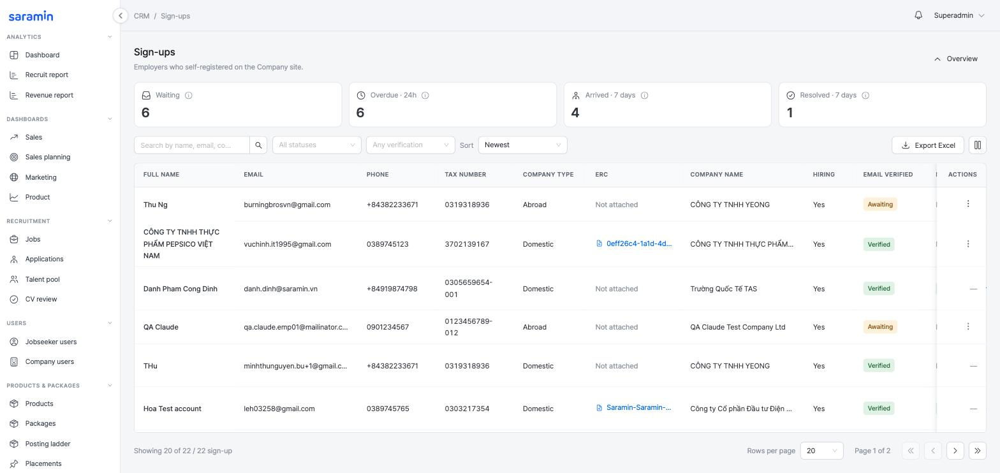
*Admin → CRM → Sign-ups*

> **⚠ Build vs requirement.** The requirement's spec page describes the 09/2026 decision in two places and they disagree with each other on one point — whether the email link alone opens the console. **The build follows the client's decision: placement opens sign-in.** Move/Create mail a sign-in notice; until then the person has no login.

### 3.3 · Verification — three labels, one button, exactly two things gated

| Label | Means | Whose move | Colour |
|---|---|---|---|
| **Verified** | An admin pressed Verify against the ERC | Nobody — posting and the official invoice are unlocked | Blue shield |
| **Waiting to verify** | Not verified, and at least one ERC is on the record | **Admin** — this is the queue; the only state in which Verify proceeds | Amber |
| **Unverified** (no paperwork) | Not verified, no ERC yet | **The employer** — upload it on Company information; an admin may upload on their behalf | Grey |

The label is **derived on every read** from the verdict plus the documents on file — never stored. That is why the filter, the row tag, the header and the Verify button can never disagree.

**Verify company** (header of the company record; permission `company:verify`, separate from editing): in *Waiting to verify* the dialog says *Verify this company's paperwork?* → **Verify** → toast *Paperwork verified*. In *Unverified* it says *There is no paperwork to rule on yet* and offers **Go to Company documents**. Assigning a sales owner is not part of Verify — a company can be verified with owner *Unassigned*.

**What Verified gates — exactly two things:**

| Action | Unverified | Verified |
|---|---|---|
| Employer posts a job (Publish **or Save draft**) | Disabled — the page asks for the ERC | Enabled |
| Sales presses **Request official invoice** on the PO | Disabled, tooltip says why (enforced server-side too) | Enabled |
| Sign in · read · upload ERC · edit Company information · Quotation · Issue PO · admin posts on the company's behalf | Allowed | Allowed |

After Verified, the employer's Company information is **read-only** (upload stays open). An **admin** edit of identity data drops the company back to Waiting to verify — silently except for the tag — and the same button clears it.

**Company documents (`/crm/company-documents`, accounting only)** is a different thing from Verify, and the two are easy to confuse:

| Path | Where the file arrives | Born as | In the review queue? |
|---|---|---|---|
| Operator attaches a file on the company record | Company record → Company documents card | Approved | No — the operator *is* the decision |
| Employer submits from the Company site | Company site → Company information | **Pending** | **Yes** — **Approve** / **Refuse** (reason ≥ 10 chars, sent to the employer verbatim) |

The **Legal changes** tab of the same page is the only path that can change a tax code once set — approving a request rewrites the company's legal record in the same transaction.

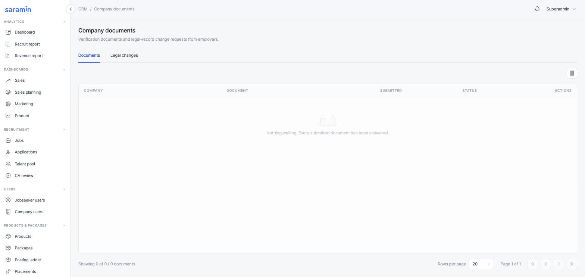
*Admin → CRM → Company documents — the review queue*

> **⚠ Build vs requirement.** The requirement puts the whole verification act on **Verify company**; the build also keeps the accounting **Company documents** review queue (Approve / Refuse per file). Both exist on dev. Worth confirming with the client whether a Refused document should also block Verify, since today *any non-rejected* file counts as paperwork.

### Test it by

1. Register on the Company site with a new email, verify the email → try to sign in → refused; a row is on Sign-ups with **Email verified ✓**.
2. Admin: **Create company & activate** → the form opens prefilled → save → the person receives the sign-in mail and can log in; the company is on Customers as **Unverified** with no owner.
3. Employer: **Post job** → Publish and Save draft disabled; upload the ERC on Company information → the tag reads **Waiting to verify** on both sites within one reload.
4. Admin: **Verify company** on an Unverified company → dialog offers Company documents only; on a Waiting company → **Verify** → **Verified**; the employer's Post job is enabled; the PO's Request official invoice is enabled.
5. Admin edits the legal name of the Verified company → **Waiting to verify**; Post job disabled again; Verify clears it.
6. Sign up with an MST that already belongs to a customer → allowed; the row's Match names that customer; **Move** pre-selects it.

---

## 4 · Quotation — `/crm/quotations`

### What it is

The **offer** — the only document the customer sees before committing. Raised from a company record (**+ Create quotation**, company pre-selected) or from the list (**+ New quotation**, pick the company). Saving the first quotation for a company **creates its deal** and puts it on the pipeline at **Proposal** — there is no separate "new deal" action.

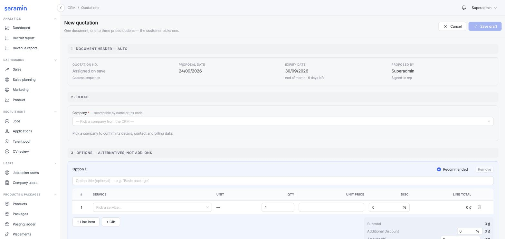
*New quotation — the builder*

### 4.1 · The builder, in reading order

| Section | What to know |
|---|---|
| **1 · Document header** (auto) | **Quotation no.** *Assigned on save*, from a gapless sequence `QUO-{seq}-{MM}-{YYYY}`. **Expiry date** = last day of the current month, always. **Proposed by** = you |
| **2 · Client** | Pick the company (name or tax code). Legal name, MST, invoice address and contact print from the company record — fix them *there*, not here |
| **3 · Options** | **Option 1–3**, each with **+ Line item** (service from the **Active** catalogue · quantity · unit price · discount) and **+ Gift** (price 0, cannot be given a price). **Options are alternatives** — the customer picks one; there is no grand total and nothing may sum them. Mark one **Recommended**. Every option needs at least one paid line |
| **Discount programme** | One per quotation, applies to the whole document. A flat % off the order routes for approval: **≤ 10 % → Sales lead**, **> 10 % → Sales manager** (straight there, not via the lead). Routing reads the **highest** % in the document; a lead's own ≤ 10 % needs nobody. Selecting **Trial package** restricts every line to trial products |
| **Totals** | Subtotal · Discount · Amount off · After discount · **VAT 8 %** · Total after VAT · the amount in Vietnamese words |

### 4.2 · Quotation status — exactly four

| Status | Means | Moves by |
|---|---|---|
| **Draft** | Being written; the **only editable** status. Already on the pipeline at Proposal | Sales: **Save draft** → **Mark as sent** |
| **Sent** | Delivered to the customer (by any channel — Sales declares it). Immutable from here | Sales: **Issue PO** and pick the accepted option |
| **Issued to PO** | An option was accepted and the PO exists. Terminal | Automatic on Issue PO. **Issue PO is spent** — a second PO is refused |
| **Expired** | Month-end passed with no PO | System. The company leaves the pipeline — this is **not Lost**: no reason, no decision, customer status untouched. **Duplicate** makes a fresh draft |

A quotation can also be **closed lost** from its detail (**Mark as lost**) or by dragging the pipeline card — with a reason; its figures freeze.

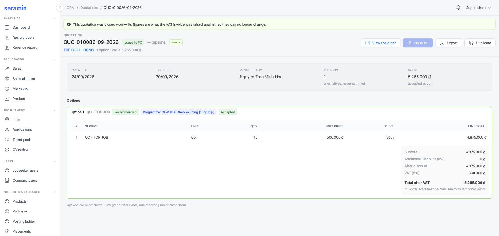
*Quotation detail — Issued to PO, the accepted option marked*

### 4.3 · Issue PO — the one dialog worth reading

**Which option did the customer accept?** — the order is copied from that one option only. **VAT billing** shows the buyer details from the company record (tick *Also make this the company's default* if the classification should stick). **Payment terms** — *100 % in advance* (default) or 50/50, which opens two receivables; method; **Expected payment date** — what the customer said, not a deadline.

Issuing the PO is the **"won" moment**: the pipeline card moves to **PO** by itself. It provisions **nothing**.

### Test it by

1. Create three quotations in a row → the numbers have no gaps.
2. Put a price on a **Gift** line → blocked. Save an option with no paid line → blocked.
3. Type 8 % under Discount programme → the bar names the **Sales lead**; type 18 % → the **Sales manager**. Change the % after approval → approval voided and re-routed.
4. **Issue PO** on a Sent quotation → status **Issued to PO**, the option is tagged *Accepted*, **View the order** appears; press Issue PO again → refused.
5. Leave a Sent quotation past month-end → **Expired**; the company is off the pipeline; its customer status did not change.

---

## 5 · Purchase order — `/crm/purchase-orders`

### What it is

The **committed order plus the payment request**, frozen from exactly the accepted option. **There is no New-order button, no edit of lines after it is with accounting, no delete and no cancel.** The list is read-only; an order exists only because a quotation option was accepted.

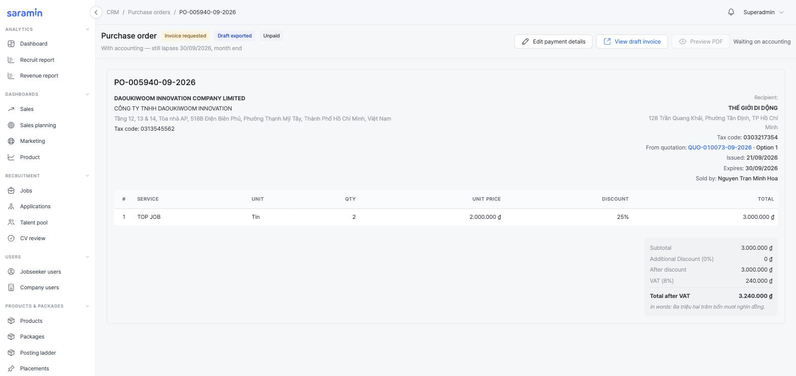
*Purchase order — one card holds the whole document*

### 5.1 · PO status — five, one forward step, one exit

| PO status | Invoice underneath | Reached by | Who |
|---|---|---|---|
| **Active** | — none | Issue PO from the accepted option. **Won**, provisions nothing | Sales |
| **Draft invoice** | Draft | **Export draft invoice** — a working document with no legal number; grants nothing. *Optional* | Sales |
| **Invoice requested** | Invoice requested | **Request official invoice** — hands the order to accounting's queue. From Active *or* Draft invoice | Sales — **needs a Verified company** |
| **Issued invoice** | Issued | Accounting issues the official e-invoice on the invoice screen. **Products land on the account in the same moment.** Terminal | Accounting only |
| **Expired** | Archived | Month-end passed with no official invoice — from Active, Draft invoice **or** Invoice requested. Nobody clicks it | System (hourly sweep) |

- **Expiry is month-end, never a rolling 30 days** — issued 05/07 and 28/07 both lapse 31/07, the same rule as the quotation. A row can still read Active a few hours past month-end before the sweep marks it; the Issue button already refuses.
- **Payment is not a status.** The header badge and the list column read **Unpaid / Partially paid / Paid** (and *Overdue +N d* when past terms). Invoicing is never gated on it.
- **Edit services** is possible only while **Active**; once requested, the figures are on a document being prepared.
- The customer's own PO number is evidence, attachable at any time — it changes nothing.

### 5.2 · Buttons per status

| Status | Header shows | Buttons |
|---|---|---|
| Active | *Valid until {date} — month end* | **Export draft invoice** · **Request official invoice** · Edit services · Preview PDF |
| Draft invoice | same | *Draft exported* badge · **View draft invoice** · **Request official invoice** |
| Invoice requested | *With accounting — still lapses {date}* | **View draft invoice** · *Waiting on accounting* |
| Issued invoice | *Products are on the customer's account* | **View invoice →** |
| Expired | *Expired {date} — raise a new PO from the quotation* | — |

### Test it by

1. Issue a PO → the PO's lines and totals equal the accepted option to the đồng; the header prints **both parties' MST**; *From quotation* links back to the right option.
2. **Request official invoice** on a PO whose company is Unverified → disabled with the reason; verify the company → enabled.
3. Try to find any way to edit or delete an Issued or Requested order → there is none (log the opposite as a bug).
4. Leave a Requested order past month-end → **Expired**; its draft invoice reads **Archived**; the company's quota is unchanged.

---

## 6 · Invoice — `/crm/invoices`

### What it is

The **VAT e-invoice** — the only fiscal document in the chain, and the single most important click in the platform: **the moment it is issued, the products are on the customer's account.** `/crm/invoices/new` does not exist; the document is prepared from a PO and only declared here.

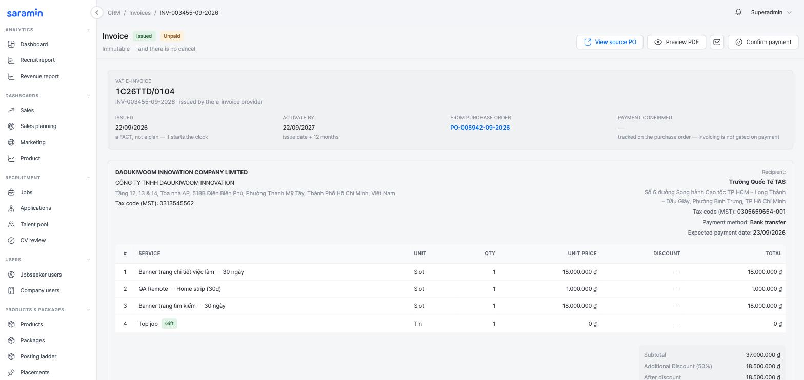
*Invoice detail — Issued alongside Unpaid, two different things*

### 6.1 · Invoice status — four, none of them stored

The invoice's status is **derived from its PO** on every read; nothing on this screen can set one.

| Invoice | PO | Means |
|---|---|---|
| **Draft** | Draft invoice | A working document, no legal number. **Grants nothing.** Can be previewed and emailed as a draft |
| **Invoice requested** | Invoice requested | In accounting's queue. Still grants nothing; the month-end clock is still running |
| **Issued** | Issued invoice | Declared with the provider; legal number on it; **immutable**. Products granted; deal WON; customer New → Existing; **Activate by** = issue date + 12 months |
| **Archived** | Expired | Its order lapsed first. Never granted anything, so nothing is clawed back. Reachable from the PO and the Archived filter |

**There is no Cancel anywhere in this module and no Cancelled status.** A wrong issued invoice is corrected on the e-invoice provider's portal, outside this system.

### 6.2 · Issue official invoice — accounting only

Permission `invoice:issue`, held by HQ admin and deliberately **not** by sales: *the person whose target depends on the deal closing must not be the person who releases the product.*

The dialog is an **email composer**: **To** (the company's contacts), **CC** (contacts + the deal owner), the invoice PDF attached (the provider's signed copy once issued), the **payment QR** always included, a link to the terms, the message body rendered by the server. Submit **declares the invoice and sends it**. The **legal number is assigned by the e-invoice provider** (EasyInvoice) and comes back with a lookup code — nobody types it. The same dialog on an already-issued invoice only sends (**Send mail** / **Resend email**).

Two numbers are always shown: ours (`INV-…`, allocated at draft) and the provider's legal number (arrives at issue). A draft that expires consumes none of the tax series.

**Confirm a customer transfer** records money against the order (tranche, amount, date, bank transaction ID). It flips **Unpaid → Partially paid / Paid** and **never grants quota again**.

> **⚠ Build vs requirement.** The requirement asks for a **legal invoice number** typed by accounting and describes invoice **cancel with claw-back**. The build integrates the provider (number returned automatically, cancel removed — a correction happens on the provider's portal). The requirement's open question on claw-back of partly-used quota is therefore moot on dev; confirm the client accepts "correct on the portal" as the procedure.

### Test it by

1. Open **Company → Products & billing** *before* issuing → the product is not there. Issue the official invoice → reload → the invoice is listed under **Purchases, by invoice** with the right slots and **until** date; the company's **Customer since** is set and status reads **Existing**; the pipeline card is in **Invoice** and closed won. *This is the central assertion of the module.*
2. **Issued** and **Unpaid** on the same document — confirm a payment → **Paid**; the slot count did not change.
3. Retry a failed issue (provider timeout) → the company must not receive double quota.
4. Try to cancel or edit an issued invoice → no control exists.

---

## 7 · Pipeline — `/crm/pipeline`

### What it is

The same deals as a board: **Proposal · Qualified · Negotiation · PO · Invoice · Lost**. **Every card is a quotation** — there is no separate deal record; clicking a card opens it. Filters: **Mine / My team's / All**, Owner, industry, period, pending approval, expiring soon.

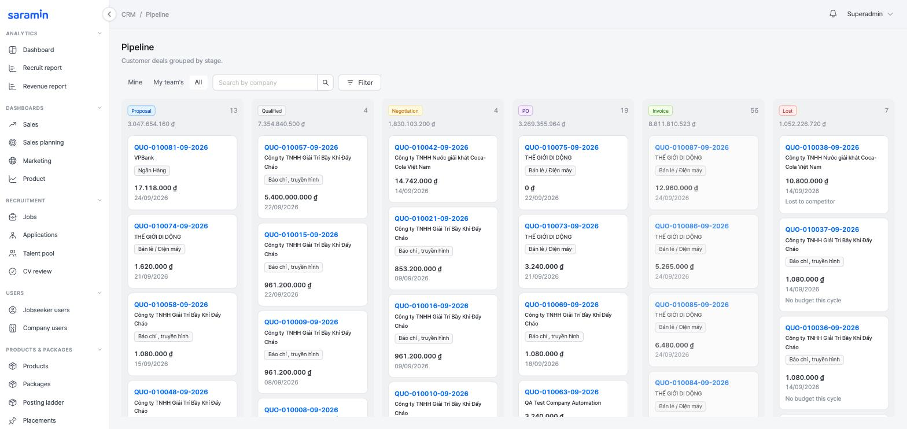
*Pipeline — the six columns*

| Column | Who moves a card in | How |
|---|---|---|
| Proposal | System / Sales | Written when the first quotation is saved; or dragged back |
| Qualified · Negotiation | Sales | Dragged — forwards **and backwards** |
| **PO** | **System only** | On **Issue PO**. Dragging in is refused with an explanation |
| **Invoice** | **System only** | On the official invoice — closes the deal **WON**. A won card does not drag; a win-back is a new deal |
| **Lost** | Sales | Dragged in, or **Close as lost** — always with a reason (competitor · price · no budget this cycle · no response · not a fit · internal approval rejected). Dragging *out* of Lost re-opens at that column |

- **At most one open deal per company.** A second is refused.
- **Card value = one option** of the live quotation (accepted, else highest) — never the sum of options. Column totals count open deals only.
- **Expiry is not Lost.** A quotation lapsing at month-end takes the company off the board and leaves the deal open with its stage.
- **No background job ever closes a deal.** Closing as Lost is a human with a reason.

### Test it by

1. Save a draft quotation for a company with no deal → a card appears at **Proposal** with that option's value.
2. Drag it to Negotiation, then back to Qualified → both accepted. Drag it to PO → refused with the message.
3. Issue the PO → the card is in **PO**; issue the invoice → **Invoice**, and it no longer drags.
4. Close a deal as lost without a reason → Save disabled. With a reason → the company's customer status is unchanged.

---

## 8 · Status reference — everything on one page

| Object | Statuses | Who moves it |
|---|---|---|
| Company | Active · Archived (+ reason) | Admin / sales lead |
| Customer status | New · Existing · Churn | System — first invoice · 12-month clock |
| Verification | Unverified · Waiting to verify · Verified | Employer's upload (derived) · Admin's Verify |
| Sales owner | Unassigned (Free data) · a rep | Admin, claim approval, handover, release |
| Free-data row | Not claimed · Waiting · step 1 · Admin · Waiting · step 2 · Sales lead | Rep asks · Admin · Sales lead |
| Claim request | Waiting · Admin · Waiting · Sales lead · Approved · Rejected | Admin (step 1) · Sales lead (step 2) · either rejects |
| Sign-up row | New (Awaiting / Verified) · Resolved · Archived | The person (email) · Admin (Move / Create / Archive) |
| Deal (pipeline) | Proposal · Qualified · Negotiation · PO · Invoice — state Open · Won · Lost | Sales · System (PO, Invoice, Won) |
| Quotation | Draft · Sent · Issued to PO · Expired (+ closed lost) | Sales · System (expiry) |
| Purchase order | Active · Draft invoice · Invoice requested · Issued invoice · Expired | Sales · Accounting · System (expiry) |
| Invoice | Draft · Invoice requested · Issued · Archived — derived from the PO | Follows the PO |
| Payment | Unpaid · Partially paid · Paid (· Overdue +N d) | Accounting confirms transfers |
| Discount approval | Requested · Approved · Refused — by Sales lead (≤ 10 %) or Sales manager (> 10 %) | Approver on the quotation |

---

## 9 · Who does what

| Role | Can | Cannot |
|---|---|---|
| **Sales rep** | Ask for a Free-data company · create/send quotations · Issue PO · Export draft invoice · Request official invoice · log activities · move a card between the three sales stages · close as lost | Create a company · approve a claim · assign an owner · Verify · issue the official invoice · edit a Sent quotation or any PO |
| **Sales lead** | Everything a rep can, on the team's book · step-2 claim approval · discount approval ≤ 10 % · Archive a company | Issue the official invoice · step-1 claim approval |
| **Sales manager** | Discount approval > 10 % | — |
| **Admin (HQ)** | Create companies · step-1 claim approval · Assign directly / Reassign · resolve Sign-ups · **Verify company** · Archive / Restore | Issue the official invoice (unless also accounting) |
| **Accounting** | **Issue official invoice** · send invoice emails · confirm payments · review Company documents and Legal changes | Create or edit any of the three documents |
| **Employer (Company site)** | Sign up · upload the ERC · edit Company information until Verified · post jobs once Verified | Sign in before placement · post before Verified · see anything of the CRM |

---

## 10 · Build vs requirement — items to confirm with the client

1. **Invoice cancel / claw-back** — removed from the build in favour of correcting on the provider's portal (§6). Confirm the procedure.
2. **Company documents review queue** (Approve / Refuse per file) exists alongside **Verify company**. Should a *Refused* file stop counting as paperwork for the Waiting label? (§3.3)
3. **Rejection note on a claim** — optional note in the build; the requirement said no reason is collected. Keep the note? (§2.2)
4. **Sales owner on placement** — the build's Move dialog asks for no owner (the destination already has one); Create company & activate uses the form's owner field, which may be left blank → the new company lands in Free data. Confirm that is acceptable for self-registered companies.
5. **Legal invoice number** — provider-assigned in the build; the requirement's typed field survives only as an outage fallback with no UI.

---

## 11 · Suggested end-to-end test scenarios

| # | Scenario | Passes when |
|---|---|---|
| 1 | Employer signs up with ERC → verifies email → admin **Create company & activate** → employer signs in → admin **Verify company** → employer publishes a job | Sign-in refused before placement; Post job disabled before Verify; both work after; the row on Sign-ups reads Resolved |
| 2 | Same company: rep creates a quotation (2 options) → Mark as sent → Issue PO on option 2 → Request official invoice → accounting issues | PO = option 2 to the đồng; Products & billing shows the products; customer status **Existing**; pipeline card in **Invoice**, won |
| 3 | Rep asks for a Free-data company → Admin approves → Sales lead approves | Company on Assigned with the rep as owner, contact #1 filled, gone from Free data, the rep's log reads Approved |
| 4 | Same, but the Sales lead rejects with a note | Company back to Not claimed with *Rejected 1 time before*; the rep reads the note on Claim requests; a second request is possible |
| 5 | PO left past month-end in Invoice requested | PO **Expired**, invoice **Archived**, no quota granted, quotation still Issued to PO |
| 6 | Verified company: admin edits the legal name → saves | Waiting to verify on both sites; Post job disabled; Request official invoice disabled; Verify restores all three |
| 7 | 15 % discount typed by a Sales lead | Routes to the Sales manager, not approved by the lead's own rank; Mark as sent blocked until approved |
| 8 | Confirm payment twice on one invoice | Second confirmation blocked once fully paid; quota unchanged both times |
| 9 | Archive a company that has an open deal | Company leaves Assigned and the pipeline; Restore returns both |
| 10 | Two reps ask for the same Free-data row | Second rep sees no Ask button while the first request is open |
